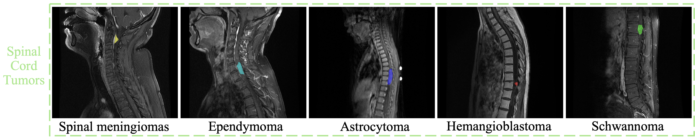
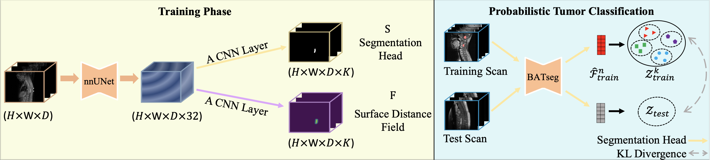

## BATseg++: Boundary-aware Multiclass Spinal Cord Tumor Segmentation on 3D MRI Scans
   Hongkang Song,  [Zihui Zhang](https://scholar.google.com.hk/citations?hl=en&user=jiwazT8AAAAJ&view_op=list_works&sortby=pubdate),  Yanpeng Zhou,  Jie Hu,  Zishuo Wang,  Hou Him Chan,  Chon Lok Lei,  Chen Xu,  Yu Xin,  [Bo Yang](https://yang7879.github.io/)
   <h4 align="center">

   [](./LICENSE)

### Overview

1) We present the first and large-scale dataset for spinal cord tumor segmentation, comprising five prevalent tumor types from 940 patients.
   
   

2) We introduce a boundary-aware loss function that enables the network to delineate 3D surfaces of each spinal cord tumor subtype in MRI volumes, enhancing segmentation accuracy by capturing surrounding structural details.

3) We adopt a probabilistic tumor classification module to achieve accurate tumor type estimation.
   
   


The code of our method is developed based on the [nnUNet](https://github.com/MIC-DKFZ/nnUNet/tree/master).

### 1. Environment

1) Install [PyTorch](https://pytorch.org/get-started/locally/) as described on their website.
2) Install BATseg:
    ```bash
    git clone https://github.com/vLAR-group/BATseg.git
    cd BATseg
    pip install -e .
    pip install cupy-cuda11x blosc2 acvl_utils==0.2 MedPy
    ```
3) Setting up Paths:

    nnUNet relies on environment variables to know where raw data, preprocessed data and trained model weights are stored. 
    To use the full functionality of nnUNet, the following three environment variables must be set:

   1) `nnUNet_raw`: This is where you place the raw datasets. This folder will have one subfolder for each dataset names 
   DatasetXXX_YYY where XXX is a 3-digit identifier (such as 001, 002, 043, 999, ...) and YYY is the (unique) 
   dataset name. The datasets must be in nnUNet format.

       Example tree structure:
       ```
       nnUNet_raw/Dataset001_NAME1
       ├── dataset.json
       ├── imagesTr
       │   ├── ...
       ├── imagesTs
       │   ├── ...
       └── labelsTr
           ├── ...
       nnUNet_raw/Dataset002_NAME2
       ├── dataset.json
       ├── imagesTr
       │   ├── ...
       ├── imagesTs
       │   ├── ...
       └── labelsTr
           ├── ...
       ```

   2) `nnUNet_preprocessed`: This is the folder where the preprocessed data will be saved. The data will also be read from 
   this folder during training. It is important that this folder is located on a drive with low access latency and high 
   throughput (such as a nvme SSD (PCIe gen 3 is sufficient)).

   3) `nnUNet_results`: This specifies where nnU-Net will save the model weights. If pretrained models are downloaded, this 
   is where it will save them.

### 2. Data preparation

To inspire more advanced methods in the future, we establish an online benchmark by holding the ground truth labels of the test split. More details are accessible at [Codabench]().


### 3. Pre-trained models

You can download all our pre-trained models from [Google Drive]().


### 4. Train

1) Experiment planning and preprocessing
   ```bash
   nnUNetv2_plan_and_preprocess -d DATASET_ID --verify_dataset_integrity
   ```

2) Model training
   ```bash
   nnUNetv2_train DATASET_NAME_OR_ID UNET_CONFIGURATION FOLD --val_best [additional options, see -h]
   ```
   UNET_CONFIGURATION is a string that identifies the requested U-Net configuration (defaults: 2d, 3d_fullres, 3d_lowres, 
   3d_cascade_lowres). DATASET_NAME_OR_ID specifies what dataset should be trained on and FOLD specifies which fold of 
   the 5-fold-cross-validation is trained.

### 5. Test

1) Automatically determine the best configuration

   Once the desired configurations were trained you can tell nnU-Net to automatically identify 
   the best combination for you:

   ```commandline
   nnUNetv2_find_best_configuration DATASET_NAME_OR_ID -c UNET_CONFIGURATION -f FOLD
   ```

   Once completed, the command will print to your console exactly what commands you need to run to make predictions. It 
   will also create two files in the `nnUNet_results/DATASET_NAME` folder for you to inspect: 
   - `inference_instructions.txt` again contains the exact commands you need to use for predictions
   - `inference_information.json` can be inspected to see the performance of all configurations and ensembles, as well 
   as the effect of the postprocessing plus some debug information. 

2) Run inference

   1) For each of the desired configurations, run:
   
      ```
      nnUNetv2_predict -i INPUT_FOLDER -o OUTPUT_FOLDER -d DATASET_NAME_OR_ID -c UNET_CONFIGURATION -f FOLD -tr nnUNetTrainer -p nnUNetPlans -chk checkpoint_best.pth --save_probabilities
      ```
   
      `--save_probabilities` will make the command save the predicted probabilities alongside of the predicted segmentation masks requiring a lot of disk space.
   
   2) Save Per-voxel Logits on Training Set
   
      ```
      nnUNetv2_train DATASET_NAME_OR_ID UNET_CONFIGURATION FOLD -tr nnUNetTrainer --val_best --save_logits --save_logits_for_training
      ```
   
   3) Save Per-voxel Logits on Validation Set

      ```
      nnUNetv2_train DATASET_NAME_OR_ID UNET_CONFIGURATION FOLD -tr nnUNetTrainer --val_best --save_logits
      ```
   
   4) Calculating Per-class Per-voxel Logits Distribution on Training Set
      
      ```
      probabilistic_tumor_classification/calculate_perclass_pervoxel_logits_distribution_on_training_set(number_of_foreground_classes, 
                                                                                                         training_feature_folder, 
                                                                                                         training_feature_stat_folder, 
                                                                                                         gt_mask_folder)
      ```
      - number_of_foreground_classes: the number of foreground classes in the dataset (tumors,organs...)
      - training_feature_folder: the folder that the per-voxel logits on training set is saved
      - training_feature_stat_folder: the folder to save per-class per-voxel logits distribution on training set
      - gt_mask_folder: the folder of the ground truth masks on training set
   5) Calculating Per-voxel Logits Distribution of a Test Scan & Classification for a Test Scan
      
      ```
      probabilistic_tumor_classification/calculate_pervoxel_logits_distribution_on_test_set_and_classify(number_of_foreground_classes, 
                                                                                                         validation_feature_folder, 
                                                                                                         training_feature_stat_folder,
                                                                                                         folder_adjust_pred)
      ```
      - number_of_foreground_classes: the number of foreground classes in the dataset (tumors,organs...)
      - validation_feature_folderthe folder that the per-voxel logits on validation set is saved
      - training_feature_stat_folder: the folder to save per-class per-voxel logits distribution on training set
      - folder_adjust_pred: the folder to save the final adjusted prediction of validation set